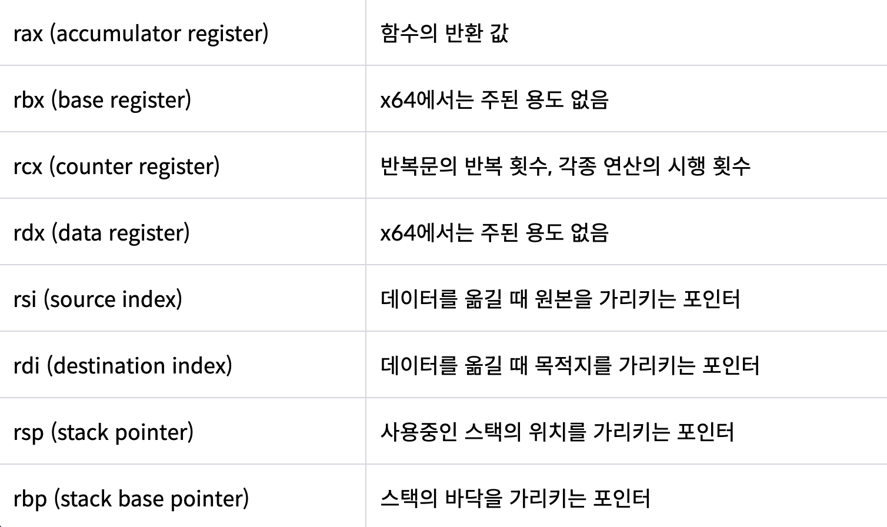

# CPU & 레지스터

## CPU (Central Processing Unit)

### CPU란?

---

- 컴퓨터에서 가장 핵심적인 역할을 수행하는 부분
- ‘**인간의 두뇌**’ 역할을 수행하는 장치
- 프로그램 명령어를 **해석(제어)** 하고, 데이터를 **연산**하며, 그 결과를 저장하거나 입출력장치로 전달

### 구성요소

---

**제어장치 (Control Unit, CU)**

- 주기억장치에서 프로그램 명령어를 꺼내 해독하고, 그 결과에 따라 명령어 실행에 필요한 제어 신호를 기억장치, 연산장치, 입출력장치로 보냄
- 데이터가 CPU 내부와 메모리, I/O 장치 사이에서 올바른 순서로 흐르도록 제어

**연산장치 (Arithmetic Logic Unit, ALU)**

- 산술 연산(+, -, \*, /)과 논리 연산(AND, OR, NOT 등)을 수행
- 연산에 필요한 데이터를 레지스터로부터 가져오고, 그 결과를 다시 레지스터로 보냄

**레지스터(Register)**

- CPU 내부에 있는 초고속 메모리
- 데이터를 **임시로 저장**하고 연산을 빠르게 수행

## 레지스터 (Register)

### 레지스터란?

---

- CPU 내부에 있는 **가장 빠른 기억 장치**
- RAM보다도 훨씬 빠르고, 용량은 작음(수십~수백개 수준)
- CPU가 연산할 데이터를 저장하거나, 연산 과정의 중간 결과를 유지

### 주요 레지스터 종류

- x86 레지스터 종류 (예시)
  

1. 프로그램 카운터(Program Counter, PC)
   - **다음에 실행할 명령어 주소 저장**
   - 명령어 실행 후 자동 증가
2. 명령어 레지스터(Instruction Register, IR)
   - 현재 실행 중인 명령어 저장
3. 메모리 주소 레지스터(Memory Address Register, MAR)
   - 접근(읽기/쓰기)하려는 메모리 주소 저장
4. 메모리 버퍼 레지스터(Memory Buffer/Data Register, MAR/MDR)
   - 메모리에서 읽은 데이터 또는 메모리에 쓸 데이터 임시 저장
5. 누산기(Accumulator, AC)
   - 연산 결과 임시 저장
   - ALU와 직접 연결되어 있음.
6. 범용 레지스터(General Purpose Register)
   - 중간 계산값, 변수 값, 주소 등을 자유롭게 저장
7. 스택 포인터(Stack Pointer, SP)
   - 스택의 최상단 주소 저장
   - 함수 호출/리턴, 지역 변수 관리에 사용
8. 상태 레지스터(Program Status Word, PSW)
   - 연산 결과에 따른 플래그 비트 저장
   - ex) Zero flag(결과가 0인지), Carry flag(올림 발생 여부), Sign flag(부호) 등

## CPU의 동작 과정

### CPU의 동작 순서

---

1. 주기억장치는 입력장치에서 받은 데이터 또는 보조기억장치에 저장된 프로그램을 읽어옴.
2. CPU는 프로그램을 실행하기 위해 주기억장치에 저장된 프로그램 명령어와 데이터를 읽어와 처리하고, 결과를 다시 주기억장치에 저장
3. 주기억장치는 처리 결과를 보조기억장치에 저장하거나 출력장치로 보냄
4. 제어장치는 1~3 과정에서 명령어가 순서대로 실행되도록 각 장치를 제어

### 명령어 세트 (Instruction Set)

---

- CPU가 이해하고 실행할 수 있는 **명령어 집합**
- 연산 코드(Operation Code) + 피연산자(Operand)로 이루어짐.
  - 연산 코드 : 어떤 연산을 할지 지정 (ex: ADD, SUB, LOAD, STORE)
  - 피연산자 : 연산에 필요한 데이터 값 또는 메모리 주소

### 명령어 사이클(Instruction Cycle)

---

> CPU는 프로그램 실행을 위해 명령어를 하나씩 인출(Fetch) → 해독(Decode) → 실행(Execute) 하는 과정을 반복함.

1. 인출 사이클 (Fetch Cycle)

   - 핵심 : PC가 가리키는 주소의 명령어를 가져오고, **PC를 다음 명령어로 증가**시킨다.

   ```
   T0 : MAR ← PC
   T1 : MBR ← M[MAR], PC ← PC+1
   T2 : IR ← MBR
   ```

   - T0 : 다음 실행할 명령어 주소(PC)를 MAR로 전달
   - T1 : 메모리(M[MAR])에서 명령어를 MDR로 읽어오고, PC를 1 증가
   - T2 : 읽어온 명령어를 IR에 적재 → 이후 해독(Decode) 단계에서 CU가 해석

2. 실행 사이클 (Execute Cycle)

   - ADD addr 연산 예시

   ```
   T0 : MAR ← IR(Addr)
   T1 : MBR ← M[MAR]
   T2 : AC ← AC + MBR
   ```

   - T0 : IR의 주소 필드를 MAR로 전달
   - T1 : 피연산자 값을 읽어옴.
   - T2 : 누산기에 더함.

3. 간접 사이클 (Indirect Cycle)
   - 필요 시, 추가적인 피연산자 주소를 메모리에서 가져옴.
4. 인터럽트 사이클 (Interrupt Cycle)
   - 인터럽트 요청이 발생하면 처리
   - 현재 PC/PSW 등을 스택에 저장하고 인터럽트 벡터로 분기

## 관련 면접 질문

- 프로그램 카운터(PC)와 명령어 레지스터(IR)의 차이는 무엇인가요?
  - PC는 다음 실행할 명령어의 주소를 저장하는 레지스터이고, 명령어 레지스터는 현재 실행 중인 명령어 자체를 저장하는 레지스터이다.
- 상태 레지스터(PSW)의 역할은 무엇인가요?
  - CPU 연산 결과와 현재 상태를 플래그 비트(flag bit) 형태로 저장하는 레지스터이다.
- 함수 호출 시 스택 포인터(SP)가 왜 중요한가요?
  - 스택 포인터가 없으면 함수 호출 시 리턴할 위치나 지역 변수 관리가 불가능하다.
