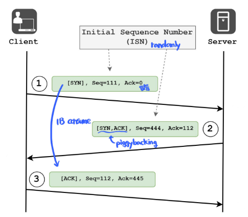
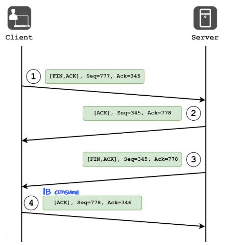
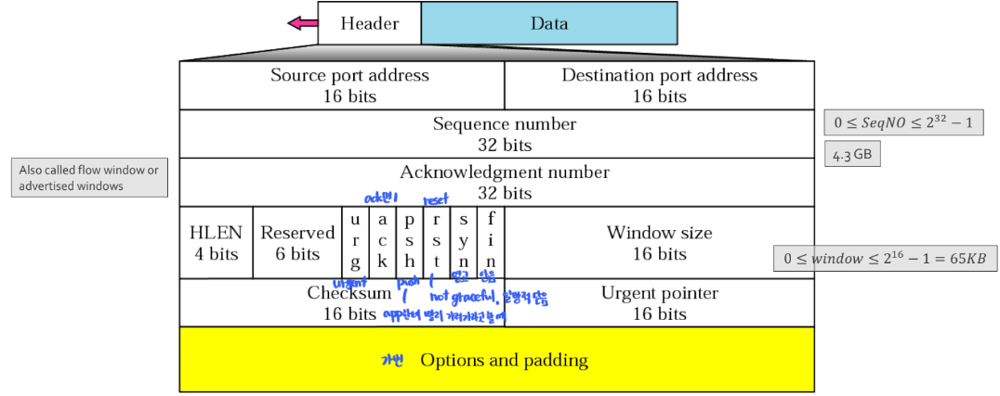

# 3-Way/4-Way 핸드셰이크

### 3-Way Handshake (연결 성립 과정)

---

**정의**

- TCP 통신에서 **연결을 시작할 때 수행되는 절차**로, 송신 측(Client)과 수신 측(Server)이 **서로의 송수신 상태를 확인하고 시퀀스 번호를 동기화**하는 과정이다.
- TCP는 신뢰성 보장을 위해 반드시 이 과정을 거쳐야만 데이터 전송이 가능하다.

**과정**

1. **SYN(Synchronize)**
   - 클라이언트 → 서버
   - 클라이언트가 서버에 연결을 요청하며, 자신이 사용할 초기 시퀀스 번호(ISN, Initial Sequence Number)를 보낸다.
   - 패킷 헤더의 `SYN = 1`, `ACK = 0` 상태
2. **SYN + ACK**
   - 서버 → 클라이언트
   - 서버는 요청을 수락하며, 자신의 초기 시퀀스 번호를 보낸다.
   - 클라이언트의 SYN에 대한 응답으로 ACK를 함께 전송. (`SYN = 1`, `ACK = 1`)
3. **ACK(Acknowledgement)**
   - 클라이언트 → 서버
   - 서버의 SYN에 대한 응답으로 ACK를 보내며 연결을 확정한다.
   - 이후 TCP 연결이 성립(ESTABLISHED 상태)된다.

**핵심**

- 양측이 서로의 송신·수신 가능 상태를 확인한다.
- 시퀀스 번호(ISN) 교환을 통해 데이터 순서 제어가 가능해진다.
- 3단계가 모두 성공해야 신뢰성 있는 양방향 통신이 시작된다.

### 4-Way Handshake (연결 종료 과정)

---

**정의**

- TCP는 **전이중(Full-duplex)** 통신을 지원하므로, 송신 방향과 수신 방향을 각각 독립적으로 종료해야 한다.
- 따라서 연결 종료 시에는 한쪽이 먼저 종료(FIN) 요청을 보내고, 상대가 이를 확인(ACK)한 후 자신의 종료 요청을 다시 보내는 **4단계 절차**를 거친다.

**과정**

1. **FIN(Finish)**
   - 클라이언트 → 서버
   - 클라이언트가 더 이상 전송할 데이터가 없음을 알림.
   - 클라이언트는 `FIN_WAIT_1` 상태로 전환
2. **ACK(Acknowledgement)**
   - 서버 → 클라이언트
   - 서버가 클라이언트의 FIN을 수락하고 ACK 응답
   - 클라이언트는 `FIN_WAIT_2`, 서버는 `CLOSE_WAIT` 상태가 됨.
   - 서버는 아직 남은 데이터를 전송할 수 있다.
3. **FIN(Finish)**
   - 서버 → 클라이언트
   - 서버도 모든 데이터를 전송 완료 후 FIN 전송
   - 서버는 `LAST_ACK` 상태로 전환
4. **ACK(Acknowledgement)**
   - 클라이언트 → 서버
   - 서버의 FIN을 수락하고 ACK 전송
   - 클라이언트는 일정 시간(`TIME_WAIT`) 대기 후 세션 완전히 종료
   - 서버는 클라이언트의 마지막 ACK를 받은 후, `CLOSED` 상태로 완전히 종료

**핵심**

- 송신과 수신을 각각 독립적으로 닫기 때문에 4단계가 필요하다
- `TIME_WAIT` 상태는 지연 패킷이나 재전송 패킷이 네트워크에 남아 있을 가능성을 고려하여 일정 시간 동안 연결 정보를 유지하는 보호 단계이다.

## 관련 면접 질문

- 왜 TCP는 3단계로 연결을 맺고 4단계로 끊을까?
  - 송수신 방향이 독립적이기 때문에, 연결 시에는 양측 동기화만 필요하지만 종료 시에는 각자 닫는 절차가 필요하기 때문.
- TIME_WAIT 상태는 왜 존재하나?
  - 늦게 도착한 패킷이나 재전송 패킷이 기존 연결에 간섭하지 않도록 일정 시간 대기하기 위함.
- UDP에는 이런 과정이 없는 이유는?
  - UDP는 비연결형 프로토콜로, 연결을 맺거나 종료하는 개념이 없기 때문.

### 참고 사진

- TCP 헤더
  
