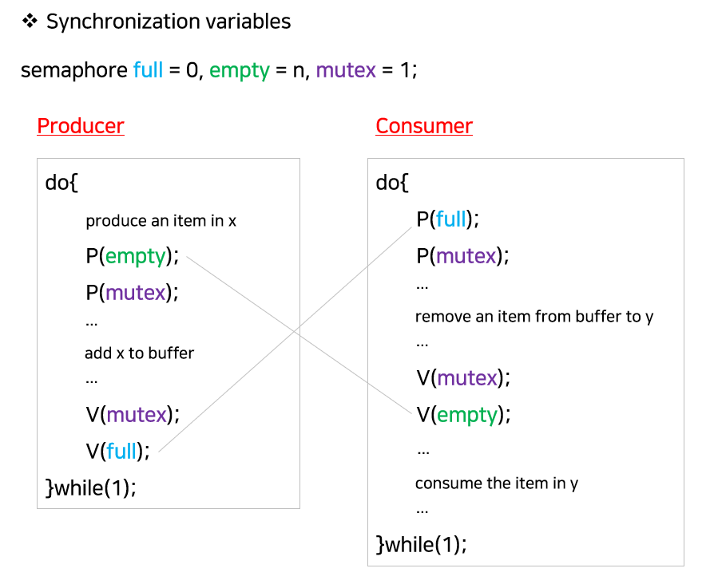
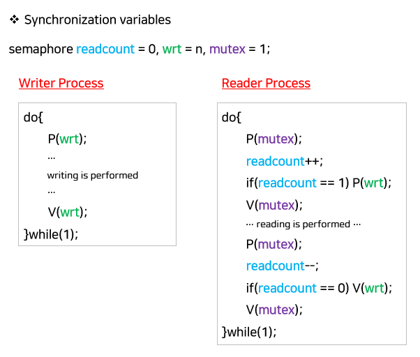
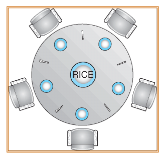
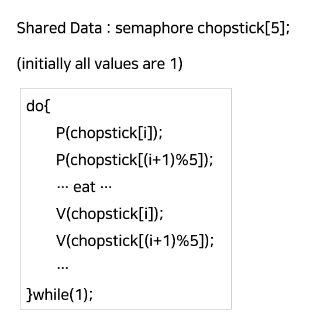

# 동기화 기법

### 동기화(Synchronization)란

**정의**

- 여러 프로세스나 스레드가 공유 자원(데이터, 파일, 메모리 등)을 동시에 접근할 때, **데이터의 일관성과 정확성**을 보장하기 위한 제어 기법

**목적**

- Race Condition 방지: 동시에 접근·수정 시 결과가 달라지는 현상
- 데이터 일관성 유지, 공유 자원 보호

### 임계 구역(Critical Section)

- **임계 구역(Critical Section)**: 동시에 하나의 프로세스만 접근해야 하는 코드 영역 → Race Condition이 발생할 수 있는 특정 부분
- 해결 조건(임계 구역 문제 해결의 3가지 조건)
  1. **상호 배제(Mutual Exclusion)**: 한 시점에 하나만 진입
  2. **진행(Progress)**: 임계 구역에 프로세스가 없을 때, 진입을 원하는 프로세스 중 하나가 반드시 들어가야 함.
  3. **한정 대기(Bounded Waiting)**: 특정 프로세스가 무한정 대기하지 않도록 보장

### 동기화 구현 기법

1. 소프트웨어 기반
   - 피터슨(Peterson) 알고리즘, Dekker 알고리즘
     - turn 변수와 flag 배열을 이용해 두 프로세스 간 상호 배제 보장
     - 학술적 의의는 크지만, 현대 시스템에서는 하드웨어 명령어 사용이 일반적
   - 단점 : Busy Waiting
2. 하드웨어 지원
   - Test-and-Set, Compare-and-Swap(CAS) 등 원자적(Atomic) 하드웨어 명령어 → 락(Lock) 구현에 활용
   - 단점 : Bounded Waiting
3. 세마포어(Semaphore)
   - **카운팅/이진 세마포어**를 통해 자원 접근 제어
   - `wait(P) / signal(P)` 연산으로 임계 구역 보호
4. 뮤텍스(Mutex)
   - **Lock/Unlock** 방식의 이진 락
   - 스레드 간 상호 배제 보장
   - 단점 : Busy Waiting
5. 모니터(Monitor)
   - 고급 언어 수준의 동기화 추상화(Java의 synchronized, condition variable 등)
6. 조건 변수(Condition Variable)
   - 모니터 내부에서 특정 조건이 만족될 때까지 스레드를 대기시키거나 깨움

### 고전적인 동기화 문제

1. Producer-Consumer Problem (Bounded-Buffer Problem)

   

   - **상황**: 생산자(Producer)는 버퍼에 데이터를 넣고, 소비자(Consumer)는 버퍼에서 데이터를 꺼냄
   - **문제**: 버퍼가 **가득 찼을 때 생산자가 더 넣거나**, **비었을 때 소비자가 꺼내면 안 됨**
   - **해결 포인트**: 버퍼 접근 시 상호 배제 + 버퍼가 비거나 가득 찼을 때의 **동기화(세마포어, 조건 변수)**

2. Readers-Writers Problem

   

   - **상황**: 여러 Reader와 Writer가 **하나의 데이터베이스를 공유**
   - **문제**:
     - 여러 Reader는 동시에 읽어도 되지만,
     - Writer가 쓰는 동안에는 **Reader·Writer 모두 접근 금지**
   - **해결 포인트**: **읽기-쓰기 동기화**, Writer 기아 방지(Aging, 우선순위 조정)

3. Dining-Philosophers Problem

   

   

   - **상황**: 원탁의 철학자들이 **양 옆의 두 포크(공유 자원)를 집어야 식사 가능**
   - **문제**: 모든 철학자가 동시에 한쪽 젓가락만 집으면 **교착상태(Deadlock)** 발생 가능
   - **해결 포인트**: **교착·기아 방지**를 위한 자원 할당 전략(순서 정하기, 제한된 동시 식사 등)

## 관련 면접 질문

- 임계 구역 문제 해결의 3조건이 무엇인가요?
  - 상호 배제, 진행, 한정 대기
- 세마포어와 뮤텍스에는 무슨 차이가 있나요?
  - 세마포어는 자원 수를 카운트할 수 있고, 뮤텍스는 단일 자원에 대해 Lock/Unlock만 제공
- Busy Waiting의 단점에는 어떤 것이 있나요?
  - CPU 자원을 낭비하므로 가능하면 Blocking 방식 사용
